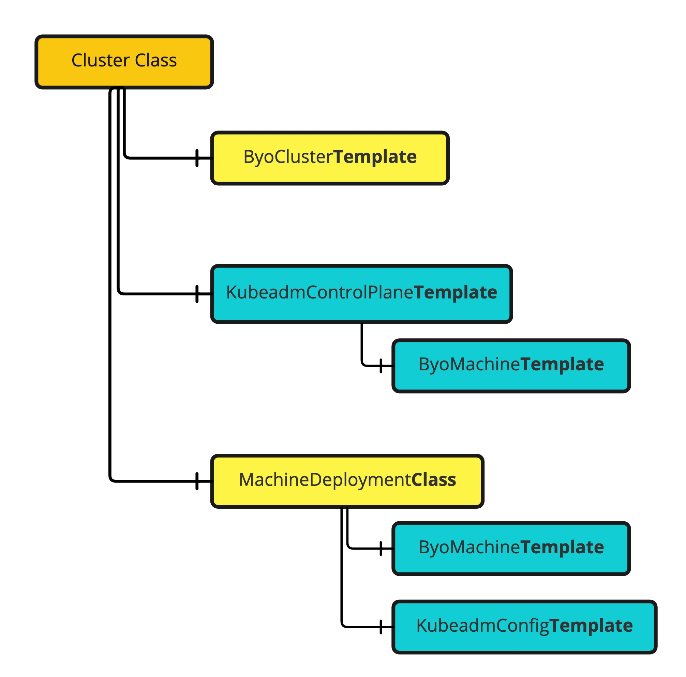

# ClusterClass and Managed Topologies in BYOH

_ClusterClass and Managed Topologies_ is a feature introduced by the [Cluster API community](https://cluster-api.sigs.k8s.io/) to simply the provisioning, upgrade, and operate multiple Kubernetes clusters in a declarative way.

### ClusterClass

ClusterClass let you define the shape of your cluster once, and reuse it many times, abstracting the complexities and the internals of a Kubernetes cluster away.

In general, it contains the collection of Cluster and Machine templates which can be leveraged to create multiple clusters of similar shape.


For instance, in BYOH we have defined one ClusterClass named `quickstart`

```yaml
apiVersion: cluster.x-k8s.io/v1beta1
kind: ClusterClass
metadata:
  name: quickstart
spec:
  controlPlane:
    ref:
      apiVersion: controlplane.cluster.x-k8s.io/v1beta1
      kind: KubeadmControlPlaneTemplate
      name: quickstart-control-plane
    machineInfrastructure:
      ref:
        kind: ByoMachineTemplate
        apiVersion: infrastructure.cluster.x-k8s.io/v1beta1
        name: quickstart-control-plane-machine
  infrastructure:
    ref:
      apiVersion: infrastructure.cluster.x-k8s.io/v1beta1
      kind: ByoClusterTemplate
      name: quickstart-cluster
  workers:
    machineDeployments:
      - class: quickstart-worker
        template:
          bootstrap:
            ref:
              apiVersion: bootstrap.cluster.x-k8s.io/v1beta1
              kind: KubeadmConfigTemplate
              name: quickstart-worker-bootstrap-template
          infrastructure:
            ref:
              apiVersion: infrastructure.cluster.x-k8s.io/v1beta1
              kind: ByoMachineTemplate
              name: quickstart-worker-machinetemplate
  variables:
    - name: bundleLookupBaseRegistry
      required: true
      schema:
        openAPIV3Schema:
          type: string
          default: "https://projects.registry.vmware.com/cluster_api_provider_bringyourownhost"
    - name: controlPlaneIpAddr
      required: true
      schema:
        openAPIV3Schema:
          type: string
    - name: kubeVipPodManifest
      required: true
      schema:
        openAPIV3Schema:
          description: kube-vip manifest for the control plane.
          type: string
  patches:
    - name: bundleLookupBaseRegistry
      description: "Sets the bundleLookupBaseRegistry used for the BYOCluster."
      definitions:
        - selector:
            apiVersion: infrastructure.cluster.x-k8s.io/v1beta1
            kind: ByoClusterTemplate
            matchResources:
              infrastructureCluster: true
          jsonPatches:
            - op: add
              path: "/spec/template/spec/bundleLookupBaseRegistry"
              valueFrom:
                variable: bundleLookupBaseRegistry
    - name: controlPlaneEndpoint
      description: "Sets control plane endpoint"
      definitions:
        - selector:
            apiVersion: infrastructure.cluster.x-k8s.io/v1beta1
            kind: ByoClusterTemplate
            matchResources:
              infrastructureCluster: true
          jsonPatches:
            - op: add
              path: "/spec/template/spec/controlPlaneEndpoint"
              valueFrom:
                template: |
                  host: '{{ .controlPlaneIpAddr }}'
                  port: 6443
    - name: kubeVipEnabled
      definitions:
        - jsonPatches:
            - op: add
              path: /spec/template/spec/kubeadmConfigSpec/files/0/content
              valueFrom:
                variable: kubeVipPodManifest
          selector:
            apiVersion: controlplane.cluster.x-k8s.io/v1beta1
            kind: KubeadmControlPlaneTemplate
            matchResources:
              controlPlane: true
```

To generate a cluster using this ClusterClass, refer below yaml where we create just one `kind` named `Cluster`
```yaml
apiVersion: cluster.x-k8s.io/v1beta1
kind: Cluster
metadata:
  name: ${CLUSTER_NAME}
spec:
  clusterNetwork:
    services:
      cidrBlocks:
        - 10.128.0.0/12
    pods:
      cidrBlocks:
        - 192.168.0.0/16
    serviceDomain: cluster.local
  topology:
    class: quickstart
    version: ${KUBERNETES_VERSION}
    controlPlane:
      metadata: {}
      replicas: 1
    variables:
      - name: bundleLookupBaseRegistry
        value: "projects.registry.vmware.com/cluster_api_provider_bringyourownhost"
      - name: controlPlaneIpAddr
        value: ${CONTROL_PLANE_ENDPOINT_IP}
      - name: kubeVipPodManifest
        value: |
          apiVersion: v1
          kind: Pod
          metadata:
            creationTimestamp: null
            name: kube-vip
            namespace: kube-system
          spec:
            containers:
            - args:
              - manager
              env:
              - name: cp_enable
                value: "true"
              - name: vip_arp
                value: "true"
              - name: vip_leaderelection
                value: "true"
              - name: vip_address
                value: ${CONTROL_PLANE_ENDPOINT_IP}
              - name: vip_interface
                value: "{{ .DefaultNetworkInterfaceName }}"
              - name: vip_leaseduration
                value: "15"
              - name: vip_renewdeadline
                value: "10"
              - name: vip_retryperiod
                value: "2"
              image: ghcr.io/kube-vip/kube-vip:v0.4.1
              imagePullPolicy: IfNotPresent
              name: kube-vip
              resources: {}
              securityContext:
                capabilities:
                  add:
                  - NET_ADMIN
                  - NET_RAW
              volumeMounts:
              - mountPath: /etc/kubernetes/admin.conf
                name: kubeconfig
            hostNetwork: true
            hostAliases:
              - hostnames:
                  - kubernetes
                ip: 127.0.0.1
            volumes:
            - hostPath:
                path: /etc/kubernetes/admin.conf
                type: FileOrCreate
              name: kubeconfig
          status: {}
    workers:
      machineDeployments:
        - class: quickstart-worker
          metadata: {}
          name: md-0
          replicas: 1
```

### How to use with clusterctl?

To create a cluster using clusterctl with managed topology, use `topology` flavor and set following environment variables :
```
CLUSTER_NAME
CONTROL_PLANE_ENDPOINT_IP
```
Also set feature flag for ClusterClass:

**Feature gate name:** `ClusterTopology`

**Variable name to enable/disable the feature gate**: `CLUSTER_TOPOLOGY`

After setting the variables use below command to create a yaml file to create a cluster with managed topology
```shell
clusterctl generate cluster <cluster-name> --kubernetes-version <kubernetes-version> --control-plane-machine-count=3 --worker-machine-count=3 \
    --flavor topology > my-cluster.yaml
```

#### clusterctl alpha topology plan

To preview  the Cluster generated using such ClusterClass, use `clusterctl alpha topology plan`

```shell
clusterctl alpha topology plan -f example-cluster-class.yaml -f example-cluster.yaml -o output/
```

To know more about clusterClass, refer to [this](https://cluster-api.sigs.k8s.io/tasks/experimental-features/cluster-class/index.html) documentation.