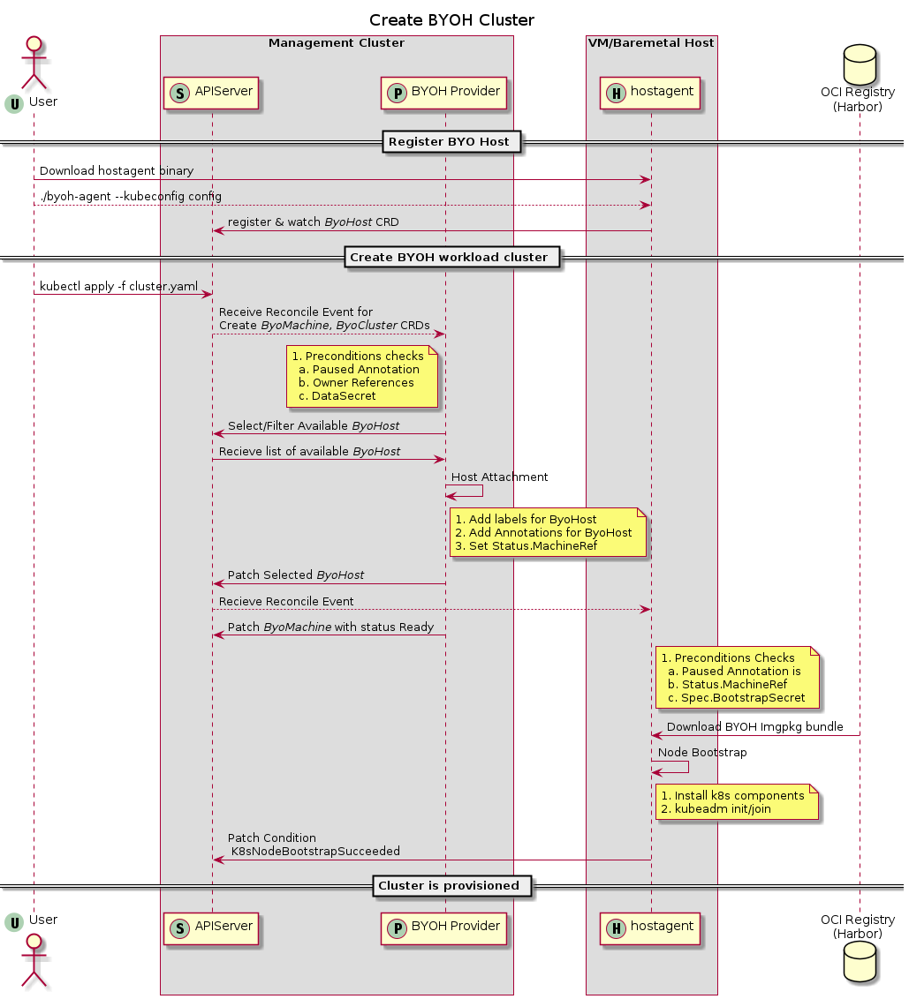

# Architecture and Design

## BYOH Infrastructure Provider components

## Sequence of operations
### Create a BYOH Cluster
This sequence diagram shows how a BYOH cluster can be created using an existing Management Cluster by
- Registering a host via host-agent on to an existing management cluster which should have BYOH provider enabled
- Creating a BYOH cluster post successful host registration in the capacity pool

