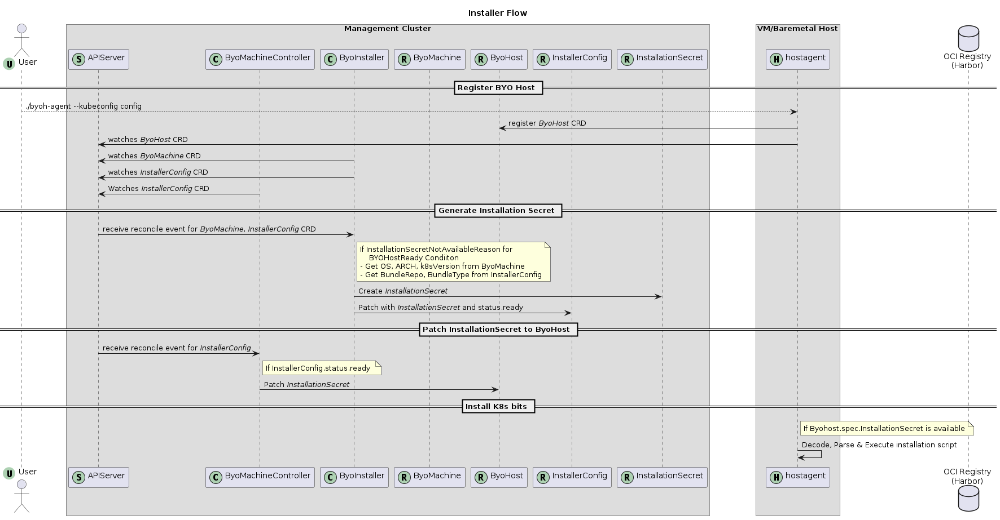

# Installer Implementation
An installer controller is responsible to provide the installation and uninstallation scripts for k8s dependencies, prerequisites and components on each `BYOHost`.
We provide a default installer ([K8sInstallerConfig](https://github.com/vmware-tanzu/cluster-api-provider-bringyourownhost/blob/main/controllers/infrastructure/k8sinstallerconfig_controller.go#L58)) to install the supported upstream k8s.
If someone wants to implement their own installer controller then they need to follow the following contract:

## Data Types
1. Must create a CustomResourceDefinition `InstallerConfigTemplate` for your `installerConfig` (eg. [K8sInstallerConfigTemplate](https://github.com/vmware-tanzu/cluster-api-provider-bringyourownhost/blob/main/apis/infrastructure/v1beta1/k8sinstallerconfigtemplate_types.go))
1. Must create a CustomResourceDefinition `InstallerConfig` (eg. [K8sInstallerConfig](https://github.com/vmware-tanzu/cluster-api-provider-bringyourownhost/blob/main/apis/infrastructure/v1beta1/k8sinstallerconfig_types.go))
1. Must be namespace-scoped
1. Must have the standard Kubernetes `type metadata` and `object metadata`
1. Must have a `status` field with the following:
    1. Required fields:
        1. `Ready` (boolean): indicates the installation secret has been generated and is ready
        2. `InstallationSecret` (ObjectReference): reference to installation secret
    2. Optional fields:
        1. `failureReason` (string): indicates there is a fatal problem reconciling the installer configuration; meant to be suitable for programmatic interpretation
        2. `failureMessage` (string): indicates there is a fatal problem reconciling the installer configuration; meant to be a more descriptive value than `failureReason`

## Reconcile flow
- If the resource does not have a `ByoMachine` owner, exit the reconciliation
- If the Cluster to which this resource belongs cannot be found, exit the reconciliation
- If `ByoMachine.status.condition.ByoHostReady` reason is not equal to `InstallationSecretNotAvailableReason`, exit the reconciliation
- If `status.ready` is true, exit the reconciliation
- Deterministically generate the name for the installation secret
- Try to retrieve the Secret with the name from the previous step
  - If it does not exist, generate installation/uninstallation data using `ByoMachine.status.hostinfo` details and create the Secret with the following data:
    - _`install`_ (string): contains installation bash script
    - _`uninstall`_ (string): contains uninstallation bash script
  - Variables: need to keep these variables in the scripts to parse by the `byoh agent`.
    - _`{{.BundleDownloadPath}}`_: path on host where bundle will be downloaded by `byoh agent`
- Set `status.installationSecret` to the generated secret object reference
- Set `status.ready = true`
- Patch the resource to persist changes

## Installer Template
`ByoMachine` refers to an installer template `ByoMachineTemplate.spec.template.spec.installerRef`.
So, `ByoMachine` controller will create the Installer CR using the `InstallerTemplate` for each `ByoMachine`.
